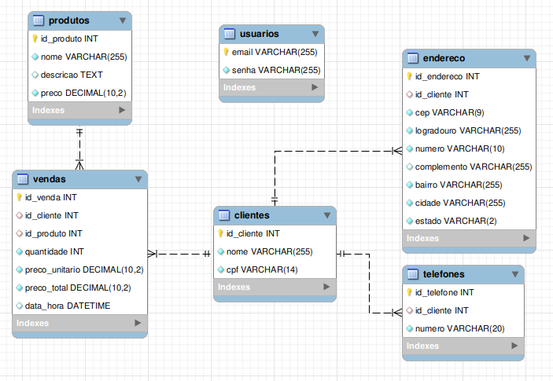

# BeTalent_API

API Restful desenvolvida em NodeJS e TypeScript com framework Adonis.JS v6 e Banco de Dados MySQL para atender a desafio técnico para vaga de backend proposto por [BeTalent.tech](https://betalent.tech).


## Índice

- Enunciado do desafio proposto
- Cumprimento dos requisitos
- [Requisitos](#requisitos)
- [Instalação e execução](#instalação-e-execução)
  - Docker
  - Sem Docker
- [Execução dos testes](#execução-dos-testes)
- [Detalhamento das rotas](#detalhamento-das-rotas)
- [Database Entities Relationships Diagram](#database-entities-relationships-diagram)
- [Arquivos de exportação da coleção de requisições para clientes HTTP (Postman/Insomnia)](#arquivos-de-exportação-da-coleção-de-requisições-para-clientes-http-postmaninsomnia)


---


<details>
<summary>Enunciado do desafio proposto.</summary>


#### Desafio
O Teste Técnico Back-end da BeTalent consiste em estruturar uma API RESTful conectada a um banco de dados.

Trata-se de um sistema que permite cadastrar usuários externos. Ao realizarem login, estes usuários deverão poder registrar clientes, produtos e vendas.

O(a) candidato(a) deve desenvolver o projeto em um dos seguintes frameworks: Adonis (Node.js) ou Laravel (PHP).


##### Banco de dados
O banco de dados deve ser estruturado à escolha do(a) candidato(a), mas minimamente deve conter:
- usuários: email, senha;
- clientes: nome, cpf;
- endereço: todos os campos de endereço;
- telefones: cliente, número;
- produtos: colocar os dados necessários para um tipo de produto, além de preço.
- vendas: cliente, produto, quantidade, preço unitário, preço total, data e hora.


##### Rotas do sistema
O sistema deve contar com rotas para:
- cadastro de usuário do sistema (signup);
- login com JWT de usuário cadastrado (login);
- clientes:
    - listar todos os clientes cadastrados (index)
        - apenas dados principais devem vir aqui;
        - ordenar pelo id;
    - detalhar um(a) cliente e vendas a ele(a) (show):
        - trazer as vendas mais recentes primeiro;
        - possibilidade de filtrar as vendas por mês + ano;
    - adicionar um(a) cliente (store);
    - editar um(a) cliente (update);
    - excluir um(a) cliente e vendas a ele(a) (delete);
- produtos:
    - listar todos os produtos cadastrados (index):
        - apenas dados principais devem vir aqui;
        - ordenar alfabeticamente.
    - detalhar um produto (show);
    - criar um produto (store);
    - editar um produto (update);
    - exclusão lógica ("soft delete") de um produto (delete);
- vendas:
    - registrar venda de 1 produto a 1 cliente (store).

- Observação: as rotas em clientes, produtos e vendas só devem poder ser acessadas por usuário logado.


##### Requisitos
São requisitos básicos:
- estruturar o sistema observando o MVC (porém, sem as views);
- usar MySQL como banco de dados;
- respostas devem ser em JSON;
- pode-se usar recursos e bibliotecas que auxiliam na administração do banco de dados (Eloquent, Lucid, Knex, Bookshelf etc.);
- documentar as instruções necessárias em um README (requisitos, como instalar e rodar o projeto, detalhamento de rotas e outras informações que julgar relevantes).

Caso o(a) candidato(a) não consiga completar o teste até o prazo definido, deve garantir que tudo que foi construído esteja em funcionamento. Neste caso, relatar no README quais foram as dificuldades encontradas.


##### Critérios de avaliação
Serão critérios para avaliação da solução fornecida:
- lógica de programação;
- organização do projeto;
- legibilidade do código;
- validação necessária dos dados;
- forma adequada de utilização dos recursos;
- seguimento dos padrões especificados;
- clareza na documentação.


##### Envio da solução
O projeto deverá ser hospedado em um repositório no GitHub. O link do repositório deverá ser fornecido no formulário.

</details>

---

<details>
<summary>Cumprimento dos requisitos.</summary>

##### Banco de dados
O banco de dados deve ser estruturado à escolha do(a) candidato(a), mas minimamente deve conter:
- [X] usuários: email, senha;
- [X] clientes: nome, cpf;
- [X] endereço: todos os campos de endereço;
- [X] telefones: cliente, número;
- [X] produtos: colocar os dados necessários para um tipo de produto, além de preço.
- [X] vendas: cliente, produto, quantidade, preço unitário, preço total, data e hora.


##### Rotas do sistema
O sistema deve contar com rotas para:
- [X] cadastro de usuário do sistema (signup);
- [X] login com JWT de usuário cadastrado (login);
- [X] clientes:
    - [X] listar todos os clientes cadastrados (index)
        - [X] apenas dados principais devem vir aqui;
        - [X] ordenar pelo id;
    - [X] detalhar um(a) cliente e vendas a ele(a) (show):
        - [X] trazer as vendas mais recentes primeiro;
        - [X] possibilidade de filtrar as vendas por mês + ano;
    - [X] adicionar um(a) cliente (store);
    - [X] editar um(a) cliente (update);
    - [X] excluir um(a) cliente e vendas a ele(a) (delete);
- [X] produtos:
    - [X] listar todos os produtos cadastrados (index):
        - [X] apenas dados principais devem vir aqui;
        - [X] ordenar alfabeticamente.
    - [X] detalhar um produto (show);
    - [X] criar um produto (store);
    - [X] editar um produto (update);
    - [X] exclusão lógica ("soft delete") de um produto (delete);
- [X] vendas:
    - [X] registrar venda de 1 produto a 1 cliente (store).

- [X] Observação: as rotas em clientes, produtos e vendas só devem poder ser acessadas por usuário logado.


##### Requisitos
São requisitos básicos:
- [X] estruturar o sistema observando o MVC (porém, sem as views);
- [X] usar MySQL como banco de dados;
- [X] respostas devem ser em JSON;
- [X] pode-se usar recursos e bibliotecas que auxiliam na administração do banco de dados (Eloquent, Lucid, Knex, Bookshelf etc.);
- [X] documentar as instruções necessárias em um README (requisitos, como instalar e rodar o projeto, detalhamento de rotas e outras informações que julgar relevantes).


</details>

---


## Requisitos

Para instalar e executar o projeto localmente em ambiente de desenvolvimento, é preciso:
- ter o Node.js, na versão 20.6 ou superior; e o NPM instalados na máquina.
- ter um banco MySQL rodando localmente. Se não tiver, leia a seção [Execução dos testes](#execução-dos-testes) que contém instruções de como instanciar rapidamente.

## Instalação e execução


```
# Clonar o repositório
$ git clone git@github.com:LCSLITX/BeTalent_API.git

# Acessar o diretório
cd BeTalent_API

# Instalar as dependências
$ npm install
```

Renomeie o arquivo `.env.example` para `.env`. As variáveis já estão pré-configuradas para rodar com o banco na porta 3306.


<details>
<summary>Caso deseje utilizar Docker (Recomendado)</summary>

Execute o seguinte comando:

```bash
# Este comando criará um container com o MySQL e outro 
$ docker compose up
# ou docker-compose up
```
Observação: Se a porta padrão do MySQL (3306) já estiver ocupada, é necessário alterar a porta padrão do MySQL no arquivo `.env` (DB_PORT), bem como no arquivo `compose.yaml` ("3306:3306": altere apenas o lado esquerdo). 

</details>


<details>
<summary>Se decidir prosseguir sem o Docker</summary>

Configure o arquivo `.env` com as credenciais de acesso do banco de dados

</details>


Depois que o banco estiver configurado e rodando, execute os seguintes comandos:

```
# Executar as migrations. 
# ATENÇÃO: Este comando apaga os dados do banco configurado no arquivo `.env`.
$ node ace migration:run

# Executar o servidor
$ npm run dev 
# ou node ace serve
```

## Execução dos testes

O projeto conta com duas suítes de testes: 1) `funcionais` e 2) `cumprimento do desafio`.

Para executar os testes, é preciso uma instância do MySQL rodando localmente e o arquivo `.env` configurado com as credenciais de acesso.

Os testes de cumprimento do desafio se prestam a evidenciar o preenchimento dos requisitos do desafio proposto, bem como dos critérios de avaliação.


```bash
# ATENÇÃO: Estes comandos irão executar as migrations e apagar
# os dados do banco configurado no arquivo .env.

# Executar os testes de cumprimento do desafio
$ npm run test-cumprimento-desafio

# Executar os testes funcionais
$ npm run test-fresh
```


## Detalhamento das rotas

Você pode verificar a [documentação detalhada](https://documenter.getpostman.com/view/19229419/2sA3kUHhss) ou utilizar o seguinte comando para visualizar as rotas e métodos disponíveis no projeto.

```bash
$ npm run routes
```


## Database Entities Relationships Diagram



## Arquivos de exportação da coleção de requisições para clientes HTTP (Postman/Insomnia)

Para facilitar o uso da API, o repositório contém três arquivos de exportação para serem importados em clientes HTTP como Postman ou Insomnia.

[Como importar no Postman](https://learning.postman.com/docs/getting-started/importing-and-exporting/importing-and-exporting-overview/) | [Como importar no Insomnia](https://docs.insomnia.rest/insomnia/import-export-data)

```bash
requests.har
requests_postman.json
requests_insomnia.json
```
